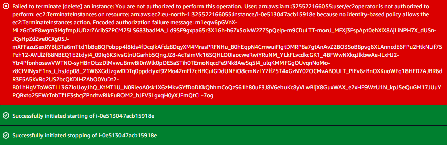

# Project 2: Custom IAM Policy

> Created a custom IAM policy to demonstrate fine-grained, action-level EC2 permissions. The policy allows a user to view and reboot EC2 instances while explicitly denying instance termination.

## 🏗️ Architecture

```text
IAM User
    |
    v
Custom IAM Policy
    |
    ├── ec2:DescribeInstances  → ALLOW
    ├── ec2:RebootInstances    → ALLOW
    └── ec2:TerminateInstances → DENY
```

## 🛠️ Tech Stack & Services Used

- **Identity & Access:** AWS IAM
- **Compute:** Amazon EC2
- **Security:** Custom IAM Policy (JSON), Explicit Deny, IAM Policy Simulator
- **Tools:** AWS Management Console

## 📋 Key Implementation Highlights

- Created a custom JSON-based IAM policy instead of using an AWS managed policy, to control permissions at the individual action level.
- Allowed `ec2:DescribeInstances` and `ec2:RebootInstances` while explicitly denying `ec2:TerminateInstances`.
- Attached the custom policy directly to an existing test IAM user (`dev1`) rather than creating a new user.
- Verified allowed and denied actions both from the EC2 console and the IAM Policy Simulator.
- Demonstrated that an explicit `Deny` statement overrides any other `Allow`, reinforcing least-privilege design.

### Custom Policy — `Custom-EC2-Control-Policy`

```json
{
  "Version": "2012-10-17",
  "Statement": [
    {
      "Effect": "Allow",
      "Action": [
        "ec2:DescribeInstances",
        "ec2:RebootInstances"
      ],
      "Resource": "*"
    },
    {
      "Effect": "Deny",
      "Action": "ec2:TerminateInstances",
      "Resource": "*"
    }
  ]
}
```

**Description:** Allows EC2 read and reboot actions while explicitly denying instance termination.

### Policy Assignment

| IAM User | Policy Attached              | Access Summary                                  |
|----------|--------------------------------|---------------------------------------------------|
| dev1     | Custom-EC2-Control-Policy       | View + Reboot EC2 (Terminate explicitly denied)   |

## 🧪 Verification & Testing

The `dev1` user was tested against all three actions defined in the custom policy, using both the EC2 console and the IAM Policy Simulator.

**Console Test Results**

| Action                  | Result   |
|--------------------------|----------|
| View EC2 instances        | ALLOWED |
| Reboot EC2 instance       | ALLOWED |
| Terminate EC2 instance    | DENIED  |

**IAM Policy Simulator Results**

| Action                  | Expected Result |
|--------------------------|------------------|
| ec2:DescribeInstances     | Allowed         |
| ec2:RebootInstances       | Allowed         |
| ec2:TerminateInstances    | Denied          |

The termination attempt was denied because the custom policy contains an explicit `Deny` on `ec2:TerminateInstances`, which cannot be overridden by any `Allow` statement. The Policy Simulator was used to confirm the denial without risking an accidental termination of a real instance.

## 📸 Screenshots

**Custom Policy Attached**


**EC2 Actions Test**



**EC2 Reboot Success**


## 🧹 Teardown & Resource Cleanup

After completing the lab:

- Detach `Custom-EC2-Control-Policy` from the test IAM user if it is not needed for another project.
- Delete the custom policy if it was created solely for this exercise.
- Avoid terminating or rebooting any EC2 instance that is in active use elsewhere.
- Review attached policies before deleting any IAM resources.

**Security Note:** Never upload IAM passwords, access keys, secret access keys, MFA secrets, recovery codes, or other credentials to GitHub.

## 🎯 Learning Outcomes

- Writing custom IAM policies in JSON
- Action-level permission control (Allow vs. Deny)
- Explicit Deny precedence over Allow statements
- Attaching customer-managed policies to IAM users
- Using IAM Policy Simulator for safe permission testing
- Principle of Least Privilege at a granular action level

## ✅ Project Result

Successfully created and verified a custom IAM policy that allowed EC2 read and reboot access while explicitly denying instance termination, confirming that fine-grained, action-level permission control works as intended.
