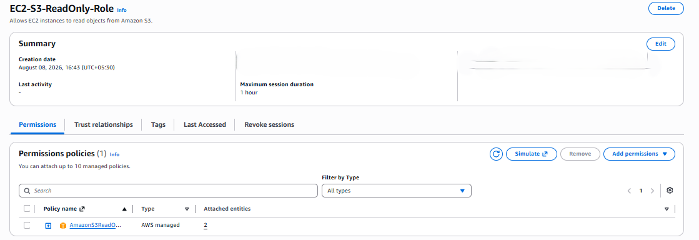
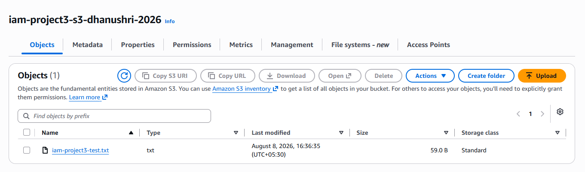
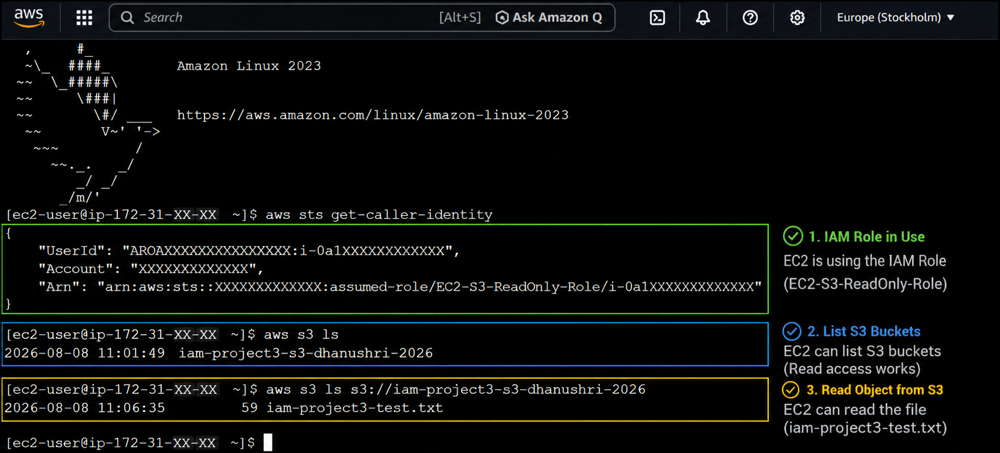

# Project 3: EC2 Access to S3 Without Access Keys (IAM Role)

> Demonstrates how an EC2 instance can access an S3 bucket using an attached IAM role and the AWS managed `AmazonS3ReadOnlyAccess` policy — with no AWS access keys stored on the instance.

## 🏗️ Architecture

```text
EC2 Instance
     |
     v
  IAM Role
     |
     v
AmazonS3ReadOnlyAccess
     |
     v
  S3 Bucket
```

## 🛠️ Tech Stack & Services Used

- **Identity & Access:** AWS IAM (Roles, AWS Managed Policies, Instance Profile)
- **Compute:** Amazon EC2
- **Storage:** Amazon S3
- **Security:** IAM Roles, Temporary Credentials, No hardcoded access keys
- **Tools:** AWS Management Console, AWS CLI

## 📋 Key Implementation Highlights

- Created an IAM role with **EC2** as the trusted AWS service.
- Attached the AWS managed policy `AmazonS3ReadOnlyAccess` to the role, instead of writing a custom policy.
- Launched an EC2 instance and attached the IAM role directly via the instance profile.
- Verified S3 access from the EC2 instance using the AWS CLI, confirming that `aws s3 ls` worked with **no access keys configured** on the instance.
- Demonstrated the core IAM Role best practice: EC2 workloads should use roles and temporary credentials instead of long-term access keys.

### IAM Role Configuration

| Setting            | Value                        |
|---------------------|-------------------------------|
| Trusted entity       | AWS service — EC2             |
| Attached policy       | `AmazonS3ReadOnlyAccess` (AWS managed) |
| Role purpose         | Allow EC2 to read from S3 without access keys |

## 🧪 Verification & Testing

After attaching the role to the running EC2 instance, connected to the instance and ran:

```bash
aws s3 ls
```

**Test Results**

| Check                                       | Result                                      |
|-----------------------------------------------|------------------------------------------------|
| `aws s3 ls` from EC2 instance                   | SUCCESS — bucket contents listed                |
| Access keys configured on the instance          | None — credentials sourced from the IAM role     |
| Write/delete operations on S3 (not granted)     | Not permitted (`AmazonS3ReadOnlyAccess` is read-only) |

This confirmed that the EC2 instance could read from S3 purely through the IAM role's temporary credentials, with no static access keys involved — the intended best practice for AWS workloads.

## 📸 Screenshots

**IAM Role & Permissions**

`screenshots/01-role-permission.png.png`

**S3 Bucket & Object**

`screenshots/02-s3-bucket-object.png`

**IAM Role Attached to EC2 Instance**

`screenshots/03-ec2-instance-role-attached.png`

**S3 Access Test (No Access Keys)**

`screenshots/04-s3-access-success.png.png`

> **Note:** `01-role-permission.png.png` and `04-s3-access-success.png.png` have a duplicated `.png.png` extension in the repo. Renaming them to `01-role-permission.png` and `04-s3-access-success.png` is recommended for consistency.

## 🧹 Teardown & Resource Cleanup

After completing the lab:

- Terminate the test EC2 instance if it's no longer needed.
- Detach and/or delete the IAM role if it isn't reused by another project.
- Review whether the S3 bucket should be retained or removed.
- Review attached policies and role trust relationships before deleting any IAM resources.

**Security Note:** Never upload IAM passwords, access keys, secret access keys, MFA secrets, recovery codes, or other credentials to GitHub.

## 🎯 Learning Outcomes

- IAM Roles
- Temporary security credentials
- AWS Managed Policies (`AmazonS3ReadOnlyAccess`)
- EC2 instance profiles
- Best practice: avoiding hardcoded access keys on EC2

## ✅ Project Result

Successfully attached an IAM role with `AmazonS3ReadOnlyAccess` to an EC2 instance and verified that the instance could access S3 using temporary role credentials, with no AWS access keys stored on the instance — confirming IAM Roles as the secure, best-practice approach for granting AWS service permissions to compute resources.
