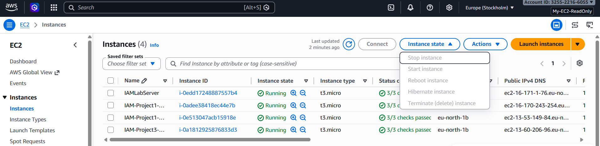

# Project 4: Cross-Account IAM Role

> Demonstrates how a developer in one AWS account can securely assume a role in another AWS account to gain temporary, scoped access — without sharing long-term credentials between accounts.

## 🏗️ Scenario

A company operates two separate AWS accounts:

- **Account A — Development**
- **Account B — Production**

Developers working in Account A occasionally need temporary, read-only access to resources in Account B (Production), without being given permanent credentials or a separate login in that account.

## 🏗️ Architecture

```text
Account A (Development)
        |
    Developer
        |
        v
   Assume Role
        |
        v
Account B (Production)
        |
        v
    EC2 ReadOnly
```

## 🛠️ Tech Stack & Services Used

- **Identity & Access:** AWS IAM (Cross-Account Roles, Trust Policies, AssumeRole)
- **Compute:** Amazon EC2 (target resource in Production)
- **Security:** Least Privilege, Temporary Session Credentials, STS AssumeRole
- **Tools:** AWS Management Console, AWS CLI / Switch Role

## 📋 Key Implementation Highlights

- Created an IAM role in **Account B (Production)** with a trust policy that allows a specific principal from **Account A (Development)** to assume it.
- Attached `AmazonEC2ReadOnlyAccess` to the cross-account role, scoping the developer's access in Production to read-only EC2 actions.
- Verified that a developer in Account A could use **Switch Role** (or `sts:AssumeRole` via the CLI) to obtain temporary credentials for Account B.
- Confirmed the developer could view EC2 resources in Production but had no permissions to modify or delete anything, consistent with least privilege.
- Demonstrated that cross-account access relies on **temporary STS credentials**, not shared or duplicated IAM users/passwords across accounts.

### Trust Policy (Account B Role)

```json
{
  "Version": "2012-10-17",
  "Statement": [
    {
      "Effect": "Allow",
      "Principal": {
        "AWS": "arn:aws:iam::<ACCOUNT_A_ID>:root"
      },
      "Action": "sts:AssumeRole"
    }
  ]
}
```

### Role Configuration

| Setting                | Value                                  |
|--------------------------|-------------------------------------------|
| Role location             | Account B (Production)                     |
| Trusted principal          | Account A (Development)                    |
| Attached policy             | `AmazonEC2ReadOnlyAccess`                   |
| Access type                 | Temporary, session-based (via AssumeRole)   |

## 🧪 Verification & Testing

A developer in Account A used the **Switch Role** feature in the AWS Console (or `aws sts assume-role` via CLI) to assume the cross-account role in Account B.

**Test Results**

| Action                                        | Result   |
|--------------------------------------------------|----------|
| Assume role from Account A into Account B          | SUCCESS |
| View EC2 instances in Production (Account B)        | ALLOWED |
| Modify/terminate EC2 instances in Production        | DENIED  |
| Access persists after session expires               | NO — credentials are temporary |

This confirmed that cross-account access worked as intended: developers could obtain short-lived, read-only access to Production without being issued permanent credentials in that account.

## 📸 Screenshots

**Cross-Account Role Access**



## 🧹 Teardown & Resource Cleanup

After completing the lab:

- Remove the cross-account role from Account B if no longer needed.
- Revoke or tighten the trust policy's principal if it was scoped broadly for testing.
- Confirm no long-term access keys were created or shared between accounts during setup.
- Review trust relationships and attached policies before deleting any IAM resources.

**Security Note:** Never upload IAM passwords, access keys, secret access keys, MFA secrets, recovery codes, or other credentials to GitHub.

## 🎯 Learning Outcomes

- Cross-account access patterns
- IAM trust policies
- `sts:AssumeRole` and temporary session credentials
- Least privilege across account boundaries
- Avoiding shared/duplicated credentials between AWS accounts

## ✅ Project Result

Successfully configured a cross-account IAM role that allowed a developer in the Development account to assume temporary, read-only access to EC2 resources in the Production account, verifying that cross-account access can be granted securely without sharing long-term credentials.
