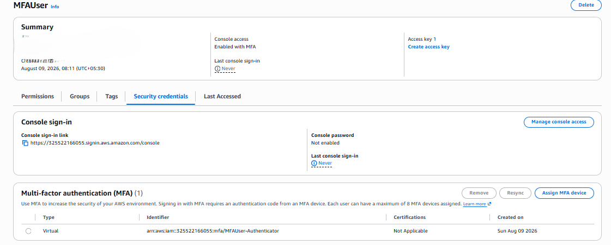
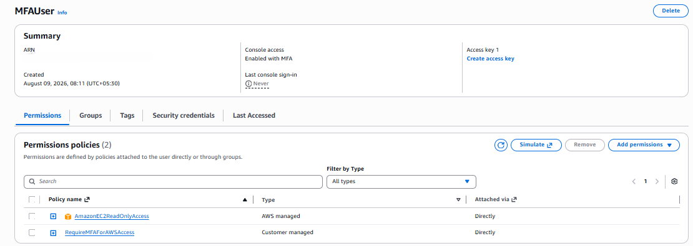

# Project 5 – IAM MFA Security

## 📌 Objective

The objective of this project is to understand and implement Multi-Factor Authentication (MFA) for an AWS IAM user.

MFA provides an additional authentication factor beyond the username and password, improving account security.

---

## 🔐 MFA Concept

### Without MFA

```text
Username + Password
        ↓
     AWS Login
```

### With MFA

```text
Username + Password + MFA Code
              ↓
          AWS Login
```

The additional MFA code is generated by an authenticator application.

---

## 🛠️ AWS Services Used

| Service | Purpose |
|---|---|
| IAM | Create the test user and configure MFA |
| EC2 | Resource used to test authenticated access |

---

## 👤 IAM User

A dedicated test user was created:

```text
MFAUser
```

The user was configured for AWS Management Console access.

---

## 🔑 Permissions

The following policies were configured for the user:

### AmazonEC2ReadOnlyAccess

Allows the user to view EC2 resources without permissions to modify or terminate instances.

### RequireMFAForAWSAccess

A customer-managed IAM policy was configured to require MFA for AWS resource access.

The policy uses the `aws:MultiFactorAuthPresent` condition to control access based on MFA authentication.

---

## 🔐 MFA Configuration

A virtual MFA device was assigned to `MFAUser` using an authenticator application.

The user must provide:

1. Username
2. Password
3. MFA verification code

to authenticate successfully.

---

## 🧪 Testing

After MFA configuration, the user signed in to the AWS Management Console using the MFA verification code.

The user was then able to access the Amazon EC2 console with read-only permissions.

The EC2 console was used to verify that the user could view EC2 instances.

---

## 🏗️ Access Flow

```text
MFAUser
   │
   ├── Username + Password
   │
   ├── MFA Code
   │
   ▼
AWS Management Console
   │
   ▼
Amazon EC2
   │
   ▼
Read-Only Access
```

---

## 📸 Screenshots

### 1. MFA Device Enabled

Shows the virtual MFA device assigned to the IAM user.



### 2. MFA User Permissions

Shows the IAM policies attached to the MFA user.



### 3. MFA Authenticated EC2 Access

Shows successful access to the EC2 console after MFA authentication.


---

## 🎯 Learning Outcomes

Through this project, I learned:

- What Multi-Factor Authentication (MFA) is.
- How to configure MFA for an IAM user.
- How to use a virtual MFA device.
- How IAM policies can enforce MFA.
- How `aws:MultiFactorAuthPresent` is used in IAM policies.
- How to apply least-privilege permissions.
- How MFA improves AWS account security.

---

