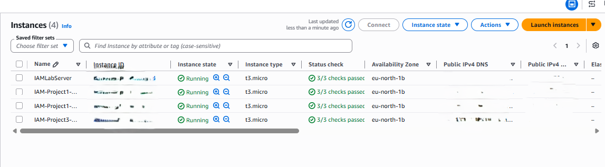

# Project 5: MFA Security

> Demonstrates how enabling Multi-Factor Authentication (MFA) on an IAM user strengthens identity protection by requiring a second factor beyond a password to sign in and access AWS resources.

## 🏗️ Architecture

```text
Create User
     |
     v
Enable Console Login
     |
     v
Configure MFA
     |
     v
Google Authenticator (Virtual MFA Device)
     |
     v
Login
```

## 🛠️ Tech Stack & Services Used

- **Identity & Access:** AWS IAM (Users, Console Access, MFA Devices)
- **Security:** Multi-Factor Authentication, Virtual MFA (Google Authenticator / TOTP)
- **Tools:** AWS Management Console

## 📋 Key Implementation Highlights

- Created an IAM user with console access enabled.
- Configured a virtual MFA device using an authenticator app (Google Authenticator) and registered it against the IAM user.
- Verified that sign-in attempts without the correct MFA code were blocked, while sign-in with the valid time-based one-time password (TOTP) succeeded.
- Confirmed the user's existing IAM permissions remained unchanged — MFA adds an authentication factor, it does not alter authorization.
- Demonstrated a core AWS identity-protection best practice: requiring MFA significantly reduces the risk of account compromise from a leaked password alone.

### MFA Setup Summary

| Step                     | Detail                                      |
|----------------------------|------------------------------------------------|
| IAM User                    | Console access enabled                           |
| MFA Device Type              | Virtual MFA (TOTP via Google Authenticator)      |
| Registration                | Device paired with IAM user in IAM console        |
| Enforcement                  | Console sign-in requires password + MFA code       |

## 🧪 Verification & Testing

Tested sign-in behavior for the IAM user both before and after MFA was enforced.

**Test Results**

| Scenario                         | Result             |
|-------------------------------------|-----------------------|
| Sign in with password only (no MFA)   | ❌ Cannot Login       |
| Sign in with password + correct MFA code | ✔ Login Successful  |
| Sign in with password + incorrect MFA code | ❌ Access Denied    |

This confirmed that MFA was correctly enforced: a valid password alone was no longer sufficient to access the account, and only a correct, time-synced MFA code allowed successful authentication.

## 📸 Screenshots

**MFA Device Enabled**


**MFA User Permissions**


**MFA-Authenticated EC2 Access**



## 🧹 Teardown & Resource Cleanup

After completing the lab:

- Deactivate and remove the virtual MFA device from the IAM user if it's a test account no longer in use.
- Delete the test IAM user if it was created solely for this exercise.
- Ensure the authenticator app entry is removed from your device once the MFA device is deactivated in AWS.
- Review IAM console access settings before deleting any IAM resources.

**Security Note:** Never upload IAM passwords, access keys, secret access keys, MFA secrets, recovery codes, or other credentials to GitHub.

## 🎯 Learning Outcomes

- Identity protection fundamentals
- Configuring virtual MFA devices
- TOTP-based authentication
- Account security best practices
- Difference between authentication (MFA) and authorization (IAM policies)

## ✅ Project Result

Successfully enabled and verified Multi-Factor Authentication on an IAM user, confirming that console sign-in required both a valid password and a correct MFA code, strengthening the account's identity security beyond password-only authentication.
