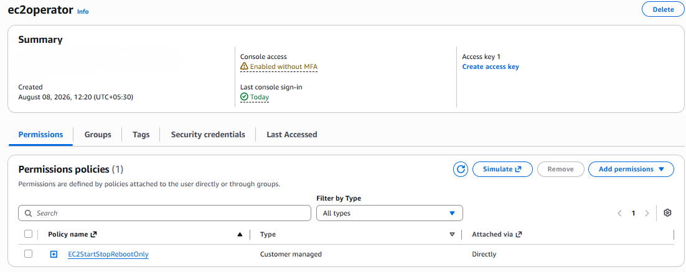
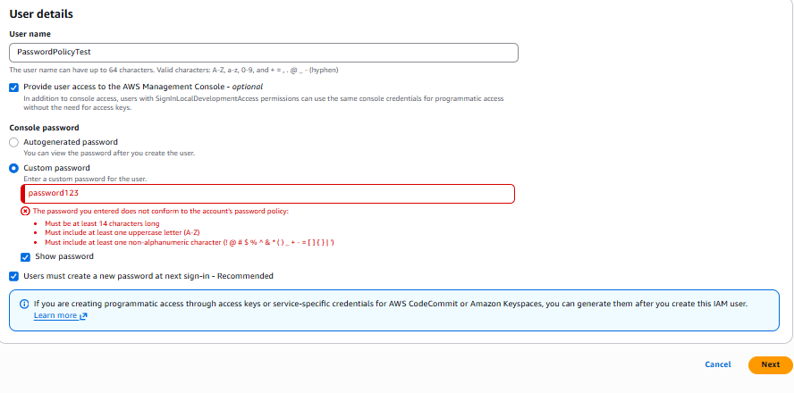
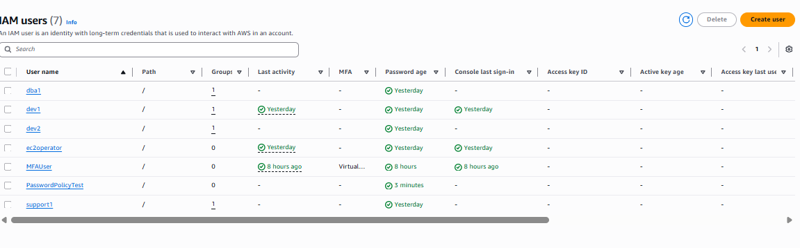

# Project 6: IAM Password Policy

> Demonstrates how to enforce a strong account-wide password policy in AWS IAM, ensuring all IAM users are required to use secure passwords and preventing password reuse.

## 🏗️ Architecture

```text
AWS Account
     |
     v
IAM Password Policy
     |
     +-- Minimum length: 14 characters
     +-- Require uppercase letters
     +-- Require lowercase letters
     +-- Require at least one number
     +-- Require at least one special character
     +-- Prevent password reuse
     |
     v
IAM Users
     |
     +-- Weak password  → REJECTED
     +-- Strong password → ACCEPTED
```

## 🛠️ Tech Stack & Services Used

- **Identity & Access:** AWS IAM (Account Password Policy)
- **Security:** Password Complexity Rules, Password Reuse Prevention
- **Tools:** AWS Management Console

## 📋 Key Implementation Highlights

- Configured an account-wide IAM password policy requiring a minimum of 14 characters.
- Enforced complexity rules requiring at least one uppercase letter, one lowercase letter, one number, and one special character.
- Enabled password reuse prevention so users cannot reset their password back to a previously used one.
- Tested the policy by attempting to set a weak password (short, no complexity) and confirming AWS rejected it.
- Tested the policy again with a strong, compliant password and confirmed it was accepted.

### Password Policy Configuration

| Setting                       | Value        |
|----------------------------------|----------------|
| Minimum password length            | 14 characters  |
| Require uppercase letters           | ✔ Enabled     |
| Require lowercase letters            | ✔ Enabled     |
| Require at least one number           | ✔ Enabled     |
| Require at least one special character | ✔ Enabled   |
| Prevent password reuse                 | ✔ Enabled     |

## 🧪 Verification & Testing

Tested the password policy by attempting to set both a non-compliant and a compliant password for an IAM user.

**Test Results**

| Password Attempt                          | Result       |
|------------------------------------------------|----------------|
| Short password with no complexity (weak)          | ❌ REJECTED   |
| 14+ character password with mixed case, number, symbol | ✔ ACCEPTED |
| Reusing a previously set password                  | ❌ REJECTED   |

This confirmed that the account-wide password policy was being enforced correctly, blocking weak or reused passwords and only allowing passwords that met all configured complexity requirements.

## 📸 Screenshots

**Custom Password Policy Configured**



**Weak Password Rejected**



**Strong Password Accepted**



## 🧹 Teardown & Resource Cleanup

After completing the lab:

- Review whether the strict password policy should remain enforced account-wide or be reverted if this was a test environment.
- Remove any test IAM users created solely to validate password rejection/acceptance.
- Document the final password policy settings for future reference before making further changes.

**Security Note:** Never upload IAM passwords, access keys, secret access keys, MFA secrets, recovery codes, or other credentials to GitHub.

## 🎯 Learning Outcomes

- Account-wide IAM password policies
- Password complexity requirements
- Preventing password reuse
- Strengthening account security through policy enforcement

## ✅ Project Result

Successfully configured and verified an AWS account password policy requiring strong, complex passwords and preventing reuse, confirming that weak passwords were rejected and only compliant passwords were accepted.
