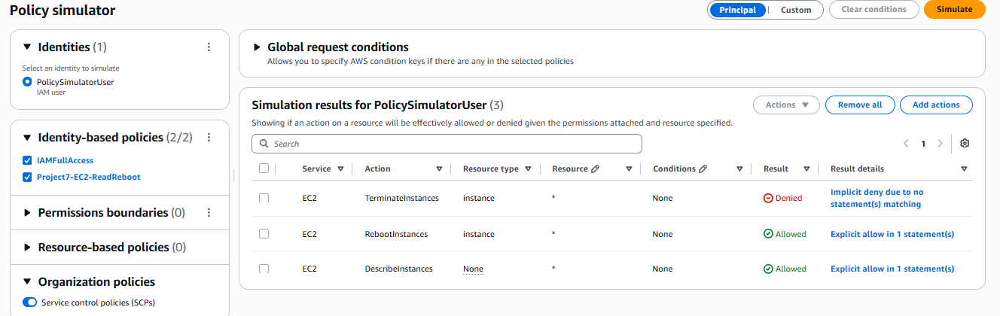

# Project 7: IAM Policy Simulator

> Demonstrates how to use the AWS IAM Policy Simulator to test and validate IAM permissions before applying them in production, without performing any real actions against live AWS resources.

## 🏗️ Architecture

```text
IAM User / Role / Policy
         |
         v
  IAM Policy Simulator
         |
    +----+----+
    |         |
    v         v
 Allowed    Denied
 Action     Action
```

## 🛠️ Tech Stack & Services Used

- **Identity & Access:** AWS IAM (Policy Simulator)
- **Security:** Permission Validation, Safe Policy Testing
- **Tools:** AWS Management Console — IAM Policy Simulator

## 📋 Key Implementation Highlights

- Used the IAM Policy Simulator to evaluate an existing IAM user's effective permissions without performing any live actions in the AWS account.
- Selected specific EC2 actions to test, including a start/read-type action expected to be allowed and a destructive action expected to be denied.
- Confirmed the simulator's results matched the actual attached policy logic — allowed actions returned "Allowed" and restricted actions returned "Denied."
- Demonstrated how the Policy Simulator can be used to safely troubleshoot and validate permissions **before** they are tested in a live environment, reducing the risk of accidental changes or outages.

### Simulated Actions

| Action Tested       | Expected Result | Why                                              |
|-----------------------|-------------------|-----------------------------------------------------|
| Start EC2 instance      | ✔ Allowed       | Permitted by the user's attached policy               |
| Delete/Terminate EC2 instance | ❌ Denied  | Not granted — or explicitly denied — by the policy     |

## 🧪 Verification & Testing

Ran the IAM Policy Simulator against the target IAM user's attached policies and tested the actions listed above.

**Test Results**

| Action                     | Simulator Result |
|-------------------------------|---------------------|
| Start EC2 instance               | Allowed            |
| Delete EC2 instance               | Denied             |

The Policy Simulator's output matched the expected permission behavior defined in the attached IAM policy, confirming that the policy was correctly scoped without needing to perform the actions against real EC2 resources.

## 📸 Screenshots

**Policy Simulator Result**



## 🧹 Teardown & Resource Cleanup

After completing the lab:

- No live AWS resources are created or modified by the Policy Simulator itself, so no cleanup of simulated actions is required.
- Remove any test IAM users or policies that were created solely to run these simulations.
- Review the policies tested here against your actual production policies to confirm they remain accurate over time.

**Security Note:** Never upload IAM passwords, access keys, secret access keys, MFA secrets, recovery codes, or other credentials to GitHub.

## 🎯 Learning Outcomes

- Using the IAM Policy Simulator
- Validating permissions safely before production use
- Troubleshooting Allow vs. Deny outcomes
- Reducing risk when testing new or modified IAM policies

## ✅ Project Result

Successfully used the IAM Policy Simulator to validate that an IAM user's permissions behaved exactly as intended — allowing safe actions and denying restricted ones — without performing any actual changes against live AWS resources.
