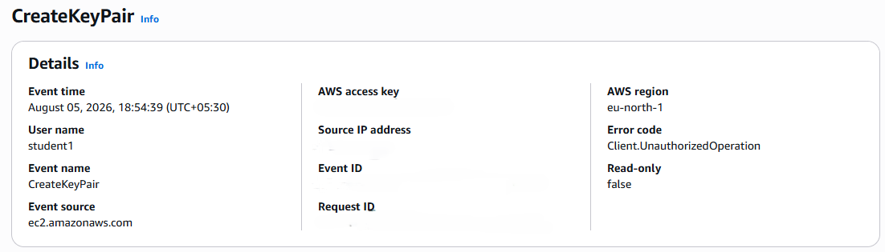

# Project 9: CloudTrail + IAM Audit

> Demonstrates how AWS CloudTrail can be used to track and audit IAM activity — recording who did what, when — supporting security monitoring and compliance requirements.

## 🏗️ Architecture

```text
IAM User
    |
    v
AWS CloudTrail
    |
    v
     S3
    |
    v
  Logs
```

## 🛠️ Tech Stack & Services Used

- **Identity & Access:** AWS IAM
- **Auditing & Monitoring:** AWS CloudTrail, Event History
- **Storage:** Amazon S3 (log storage)
- **Security:** Auditing, Compliance, Activity Tracking
- **Tools:** AWS Management Console

## 📋 Key Implementation Highlights

- Confirmed AWS CloudTrail was actively recording management events across the account, including IAM API calls.
- Performed a set of IAM actions to generate audit trail entries: creating a user, deleting a user, and attaching a policy.
- Reviewed CloudTrail's Event History to locate and inspect each of these IAM actions, including the identity that performed them and the timestamp.
- Verified that CloudTrail logs provide the "who, what, when" needed to support security investigations and compliance audits.
- Demonstrated how CloudTrail logs (optionally delivered to S3) create a durable audit trail independent of the IAM console itself.

### IAM Actions Audited

| Action Performed     | Captured in CloudTrail |
|-------------------------|---------------------------|
| Create IAM User            | ✔ Yes                    |
| Delete IAM User             | ✔ Yes                    |
| Attach IAM Policy            | ✔ Yes                    |

## 🧪 Verification & Testing

Performed the IAM actions listed above, then reviewed AWS CloudTrail's Event History to confirm each was logged.

**Test Results**

| CloudTrail Check                          | Result   |
|-----------------------------------------------|------------|
| `CreateUser` event recorded                     | FOUND    |
| `DeleteUser` event recorded                      | FOUND    |
| `AttachUserPolicy` event recorded                 | FOUND    |
| Event details include requesting user & timestamp   | CONFIRMED |

This confirmed that every IAM action performed in the account was captured by CloudTrail with enough detail (event name, requesting identity, timestamp) to support auditing and compliance reviews.

## 📸 Screenshots

**CloudTrail Event History**



## 🧹 Teardown & Resource Cleanup

After completing the lab:

- Remove any test IAM users created solely to generate audit events.
- Review whether CloudTrail should remain enabled account-wide (recommended as a security best practice, regardless of this lab).
- If a dedicated S3 bucket was created just for this exercise's log storage, review it for cleanup or retention needs.

**Security Note:** Never upload IAM passwords, access keys, secret access keys, MFA secrets, recovery codes, or other credentials to GitHub.

## 🎯 Learning Outcomes

- AWS CloudTrail fundamentals
- Auditing IAM activity
- Reading and interpreting CloudTrail Event History
- Supporting compliance and security investigations with activity logs

## ✅ Project Result

Successfully used AWS CloudTrail to audit IAM activity, confirming that user creation, deletion, and policy attachment actions were all logged with sufficient detail to support security monitoring and compliance requirements.
