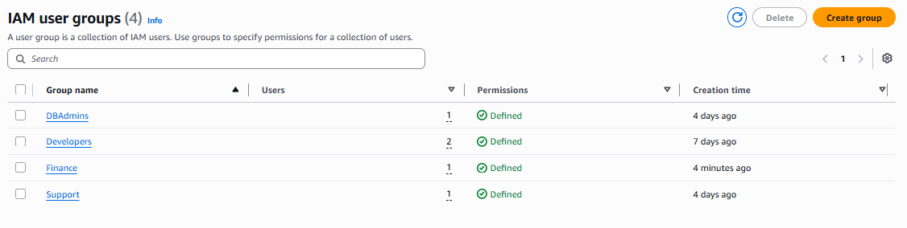

# Project 10: Mini Company IAM Design (Capstone)

> A capstone project that designs and implements a complete IAM access model for a fictional company, ABC Technologies, applying every concept from Projects 1–9 — groups, custom and managed policies, roles, MFA, password policy, and auditing — into a single, realistic enterprise scenario.

## 🏗️ Company Scenario

**ABC Technologies** has six departments, each requiring different levels of AWS access:

| Department      | Users | Required Access             |
|--------------------|---------|---------------------------------|
| Developers            | 5       | EC2, CloudWatch                   |
| DevOps                 | 2       | AdministratorAccess                |
| Database Team            | 2       | RDS                                |
| Security                  | 2       | IAM ReadOnly, CloudTrail             |
| Finance                    | 2       | Billing Only                          |
| HR                          | 1       | No AWS Access                          |

## 🏗️ Architecture

```text
                        ABC Technologies (AWS Account)
                                    |
      +----------+----------+----------+----------+----------+
      |          |          |          |          |          |
      v          v          v          v          v          v
 Developers   DevOps    Database    Security    Finance      HR
      |          |       Team          |          |           |
      v          v          |          v          v           v
 EC2 + Admin-   Full     v      IAM RO +    Billing     No AWS
 CloudWatch   Access    RDS    CloudTrail    Only         Access
      |          |        |         |          |
      v          v        v         v          v
 5 users     2 users   2 users   2 users    2 users
```

## 🛠️ Tech Stack & Services Used

- **Identity & Access:** AWS IAM (Groups, Users, Roles, Custom & Managed Policies)
- **Compute:** Amazon EC2
- **Database:** Amazon RDS
- **Monitoring & Auditing:** Amazon CloudWatch, AWS CloudTrail
- **Billing:** AWS Billing & Cost Management
- **Storage:** Amazon S3 (via EC2 IAM Role)
- **Security:** MFA, Strong Password Policy, Least Privilege, IAM Policy Simulator
- **Tools:** AWS Management Console

## 📋 Key Implementation Highlights

- Designed and created **5 IAM groups** — one per department requiring AWS access (Developers, DevOps, Database Team, Security, Finance).
- Created **12 IAM users** across the company and assigned each to their correct department group.
- Attached the appropriate AWS Managed or Customer Managed Policy to each group, matching the access column in the scenario table.
- Enabled **MFA** for every IAM user with console access, applying the identity-protection practice from Project 5.
- Configured a **strong account-wide password policy** (14+ characters, complexity rules, reuse prevention) as in Project 6.
- Created an **IAM Role for EC2** with `AmazonS3ReadOnlyAccess`, reusing the role-based access pattern from Project 3.
- Verified access by signing in as a representative user from each department and confirming allowed/denied actions matched the design.
- Used the **IAM Policy Simulator** (Project 7) to validate permissions for each group before relying on live testing.
- Reviewed **AWS CloudTrail** (Project 9) to confirm that IAM changes made during setup were properly logged for audit purposes.
- Left the **HR department with no AWS access at all**, since HR has no operational need to touch the AWS account — a deliberate, explicit "no access" design decision rather than an oversight.

### IAM Groups and Policies

| IAM Group     | Policy Type            | Policy Applied                          | Access Summary            |
|-----------------|--------------------------|---------------------------------------------|------------------------------|
| Developers          | AWS Managed                | `AmazonEC2ReadOnlyAccess`, `CloudWatchReadOnlyAccess` | EC2 + CloudWatch (read-only)  |
| DevOps                | AWS Managed                | `AdministratorAccess`                        | Full administrative access     |
| Database Team           | AWS Managed                | `AmazonRDSFullAccess`                          | Full RDS access                  |
| Security                  | AWS Managed                | `IAMReadOnlyAccess`, CloudTrail read access      | IAM visibility + audit logs       |
| Finance                     | Custom / Billing-scoped        | Billing Policy                                     | Billing Dashboard only               |
| HR                            | None                              | —                                                     | No AWS access                          |

### IAM Users (12 total)

| User(s)                                  | Group          |
|----------------------------------------------|------------------|
| dev1, dev2, dev3, dev4, dev5                    | Developers         |
| devops1, devops2                                  | DevOps               |
| dba1, dba2                                          | Database Team          |
| sec1, sec2                                            | Security                 |
| finance1, finance2                                      | Finance                    |

> HR has 1 user with no group membership, reflecting "No AWS Access."

## 🧪 Verification & Testing

Signed in as a representative user from each department and used the IAM Policy Simulator to cross-check results before/alongside live testing.

**Test Results**

| Department      | Action Tested                  | Result   |
|-------------------|-----------------------------------|------------|
| Developers             | View EC2 instances                    | ALLOWED  |
| Developers             | Terminate EC2 instance                 | DENIED   |
| DevOps                   | Perform any AWS action                   | ALLOWED  |
| Database Team              | Manage RDS instances                        | ALLOWED  |
| Database Team              | Access EC2 console                            | DENIED   |
| Security                     | View IAM users/policies (read-only)             | ALLOWED  |
| Security                     | Modify IAM users/policies                         | DENIED   |
| Finance                        | View Billing Dashboard                              | ALLOWED  |
| Finance                        | Access EC2/IAM/S3                                     | DENIED   |
| HR                                | Sign in to AWS Console                                  | DENIED / No access |

CloudTrail was reviewed to confirm that group creation, policy attachments, and user creation during this setup were all captured in Event History, consistent with the auditing practice from Project 9.

## 📸 Screenshots

**Company IAM Groups Structure**



> **Note:** This project's image folder is named `screenshot` (singular) in the repo, unlike the `screenshots` (plural) folder used in other projects — worth standardizing for consistency. The file also has a duplicated `.png.png` extension; renaming it to `01-company-iam-groups.png` is recommended.

## 🧹 Teardown & Resource Cleanup

After completing the lab:

- Remove all 12 test IAM users if this was a training exercise rather than a real company setup.
- Delete the 5 IAM groups and detach their policies if no longer needed.
- Deactivate and remove MFA devices tied to test users.
- Revert the account password policy if it was configured solely for this exercise.
- Delete the EC2 IAM role if it isn't reused by another project.
- Review CloudTrail logs one final time to confirm all cleanup actions are also captured.

**Security Note:** Never upload IAM passwords, access keys, secret access keys, MFA secrets, recovery codes, or other credentials to GitHub.

## 🎯 Learning Outcomes

- End-to-end IAM architecture design for a multi-department organization
- Combining AWS Managed and Customer Managed Policies at scale
- Applying Least Privilege across departments with very different access needs
- Enforcing MFA and password policy account-wide
- Using IAM Roles for service-to-service access (EC2 → S3)
- Validating a full permission model with the IAM Policy Simulator
- Auditing IAM changes with CloudTrail
- Making deliberate "no access" decisions where access isn't needed (HR)

## ✅ Project Result

Successfully designed and implemented a complete IAM access model for ABC Technologies, covering 5 departments and 12 users, and verified — through direct testing, the IAM Policy Simulator, and CloudTrail — that each department's access matched its business need exactly, with no department having more permission than required.
